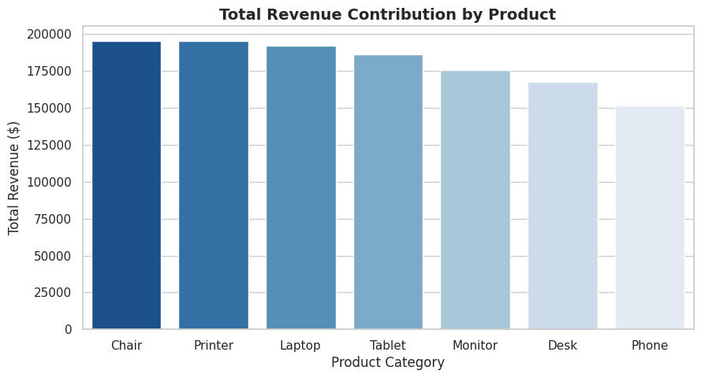
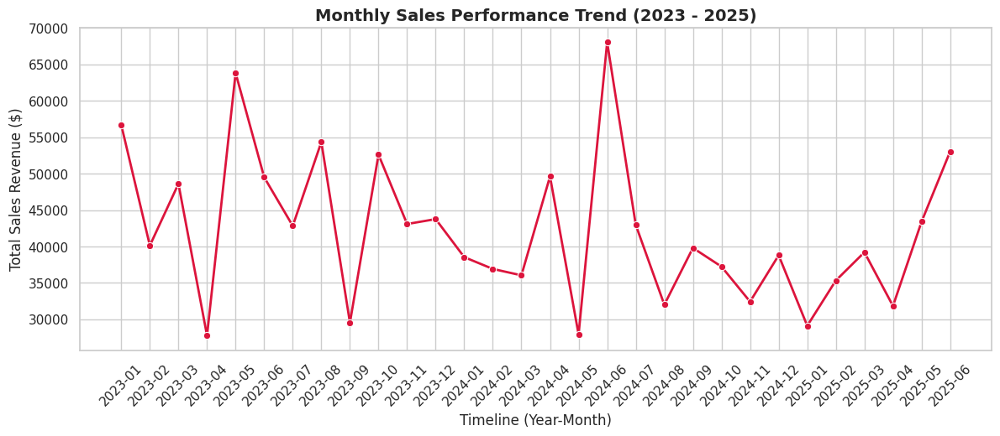
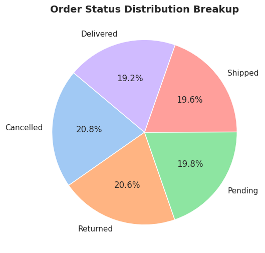
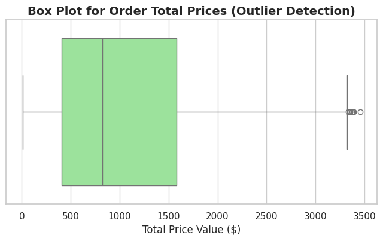

# Data Analytics Project 2

## Overview
This project focuses on performing exploratory data analysis (EDA), data cleaning, statistical analysis, and visualization on an e-commerce sales dataset using Python. The project demonstrates how raw business data can be transformed into meaningful insights through analytical techniques and visual storytelling.

The analysis includes:
- Data cleaning and preprocessing
- Descriptive statistical analysis
- Product performance evaluation
- Revenue trend analysis
- Payment method and referral source analysis
- Outlier detection
- Data visualization using charts and plots

---

## Project Structure

```bash
Data_Analytics_Project_2/
│
├── Project2.ipynb                  # Jupyter Notebook version of the project
├── Project2.py                     # Python script version of the analysis
├── Dataset for Data Analytics.xlsx # Original dataset
├── processed_data.xlsx             # Cleaned and processed dataset
│
├── product_revenue.png             # Product revenue visualization
├── monthly_sales_trend.png         # Monthly sales trend chart
├── order_status_pie.png            # Order status distribution chart
├── total_price_boxplot.png         # Outlier detection boxplot
│
└── Data analytics P2.pdf           # Project report/documentation
```

---

## Technologies Used

- Python
- Pandas
- NumPy
- Matplotlib
- Seaborn
- Jupyter Notebook
- Microsoft Excel

---

## Dataset Description

The dataset contains e-commerce transaction information including:

- Order details
- Product categories
- Quantity sold
- Unit prices
- Total revenue
- Payment methods
- Coupon codes
- Referral sources
- Order status
- Purchase dates

---

## Features Implemented

### 1. Data Cleaning & Preprocessing
- Converted date columns into proper datetime format
- Handled missing values in coupon codes
- Checked dataset integrity and missing records

### 2. Descriptive Statistics
- Generated summary statistics for:
  - Quantity
  - Unit Price
  - Items in Cart
  - Total Price

### 3. Product Performance Analysis
- Identified top-performing products based on:
  - Total revenue
  - Quantity sold
  - Average unit price
  - Number of orders

### 4. Payment Method Analysis
- Compared payment methods by:
  - Total revenue
  - Number of orders

### 5. Referral Source Analysis
- Evaluated which referral channels generated the highest revenue and order volume.

### 6. Sales Trend Analysis
- Created monthly revenue trends to analyze business performance over time.

### 7. Order Status Distribution
- Visualized the distribution of order statuses using pie charts.

### 8. Outlier Detection
- Applied the Interquartile Range (IQR) method to identify revenue outliers.
- Visualized outliers using boxplots.

---

## Screenshots

### Product Revenue Analysis

<p align="center">
  
</p>

This visualization shows the revenue contribution of different products and helps identify the highest-performing products.

---

### Monthly Sales Trend

<p align="center">
  
</p>

This chart illustrates monthly revenue trends and highlights seasonal sales patterns.

---

### Order Status Distribution

<p align="center">
  
</p>

The pie chart represents the distribution of order statuses such as completed, pending, or cancelled orders.

---

### Revenue Outlier Detection

<p align="center">
  
</p>

The boxplot helps identify abnormal or high-value transactions using outlier analysis.

---

## Visualizations

| Visualization | Description |
|---|---|
| `product_revenue.png` | Revenue contribution by product |
| `monthly_sales_trend.png` | Monthly sales performance trend |
| `order_status_pie.png` | Order status distribution |
| `total_price_boxplot.png` | Revenue outlier detection |

---

## Installation & Setup

### Clone the Repository

```bash
git clone <repository-url>
cd Data_Analytics_Project_2
```

### Install Dependencies

```bash
pip install pandas numpy matplotlib seaborn openpyxl
```

---

## Running the Project

### Run Jupyter Notebook

```bash
jupyter notebook Project2.ipynb
```

### Run Python Script

```bash
python Project2.py
```

---

## Sample Insights

Some example insights derived from the analysis:

- Certain products contribute significantly more revenue than others.
- Monthly sales patterns reveal seasonal business trends.
- Specific payment methods are more popular among customers.
- Referral sources influence customer acquisition and revenue generation.
- Outlier transactions may indicate premium purchases or abnormal behavior.

---

## Learning Outcomes

This project helps in understanding:

- Real-world data preprocessing
- Exploratory Data Analysis (EDA)
- Business intelligence concepts
- Statistical analysis techniques
- Data visualization best practices
- Python-based analytics workflows

---

## Future Improvements

Possible enhancements for the project:

- Interactive dashboards using Plotly or Power BI
- Machine learning-based sales forecasting
- Customer segmentation analysis
- KPI dashboard development
- Advanced predictive analytics

---

## Submitted By

**Name:** Mittal Makwana

**Role:** Data Analytics Intern / Trainee

**Organization:** DecodeLabs

**Project:** SQL Data Analysis

**Year:** 2026
